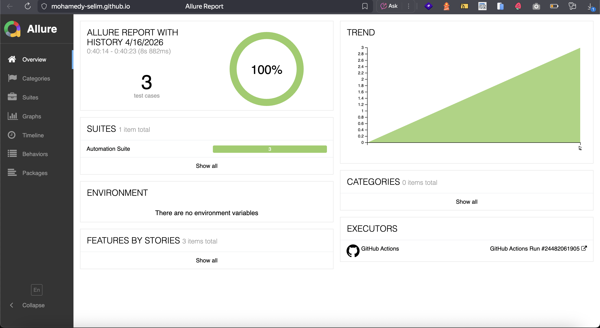

# Selenium Login Automation Task

## Overview
This project is a Selenium WebDriver automation suite built using Java to test a local HTML login page.

The suite validates these scenarios:
- Successful login
- Invalid login
- Empty fields submission

The framework is designed using Page Object Model (POM), reusable utility classes, parallel execution support, and CI integration with Allure reporting.

---

## 🔗 Live Allure Report

You can view the latest test execution report here:

👉 https://mohamedy-selim.github.io/selenium-task-MohamedYehia/

---

## 📸 Report Preview



---

## Test Scenarios

### TC-001: Successful Login
- Open the local `login.html` page
- Enter valid credentials
- Click the sign-in button
- Assert the success heading is visible
- Assert the welcome message contains the username

### TC-002: Invalid Credentials
- Enter invalid username and password
- Click the sign-in button
- Assert the error message is displayed:
  `Invalid username or password. Please try again.`

### TC-003: Empty Fields Submission
- Leave username and password empty
- Click the sign-in button
- Assert username required message is displayed
- Assert password required message is displayed
- Assert both inputs have error styling

---

## Tech Stack
- Java
- Selenium WebDriver 4
- TestNG
- Maven
- Allure Reports
- Log4j2
- GitHub Actions

---

## Project Structure

```text
src
├── main
│   ├── java
│   │   ├── base
│   │   ├── config
│   │   ├── factory
│   │   ├── pages
│   │   └── utils
│   └── resources
│       ├── login.html
│       ├── log4j2.xml
│       └── testing.properties
└── test
    ├── java
    │   └── tests
    └── resources
        └── testdata
            └── login.json
```

---

## Framework Highlights
- Page Object Model (POM)
- ThreadLocal WebDriver for parallel execution
- Reusable waits and element actions
- JSON-based test data
- Screenshots attached to Allure
- Page source attached on failures
- GitHub Actions CI workflow
- Allure report published to GitHub Pages

---

## How to Run

### Run locally
```bash
mvn clean test -Dbrowser=chrome
```

### Run headless
```bash
mvn clean test -Dbrowser=chrome -Dheadless=true
```

---

## Parallel Execution
Parallel execution is configured through `testng.xml` using method-level parallelism.

```xml
<suite name="Automation Suite" parallel="methods" thread-count="3" data-provider-thread-count="3">
```

---

## Test Data
Test data is stored in JSON format under:

```text
src/test/resources/testdata/login.json
```

It includes:
- `validUser`
- `invalidUser`
- `emptyUser`

---

## Reporting

### Local Allure Report
```bash
allure serve target/allure-results
```

### Hosted Allure Report
The report is automatically generated in CI and published to GitHub Pages.

---

## CI/CD
GitHub Actions pipeline performs the following:
- Checks out the repository
- Sets up Java
- Installs Chrome
- Runs tests in headless mode
- Uploads `allure-results`
- Generates Allure report
- Publishes the report to GitHub Pages

---

## Locator Strategy Notes
The login button does not have a direct ID on the clickable button element, so it is located using a stable XPath based on the nested span:

```java
By.xpath("//button[.//span[@id='sign-in-label']]")
```

This approach targets the actual clickable element while keeping the locator stable and readable.

---

## Author
Mohamed Yehia
